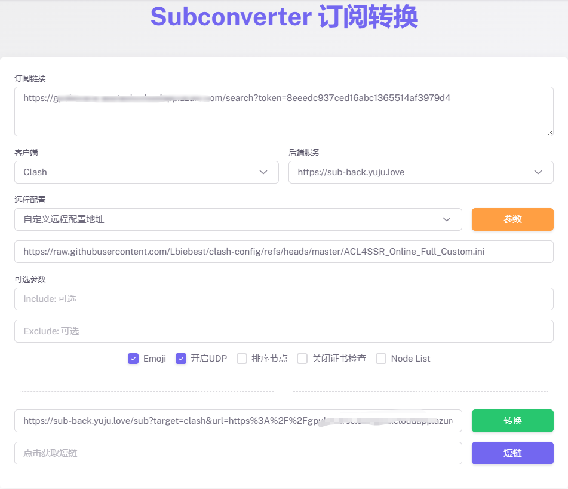
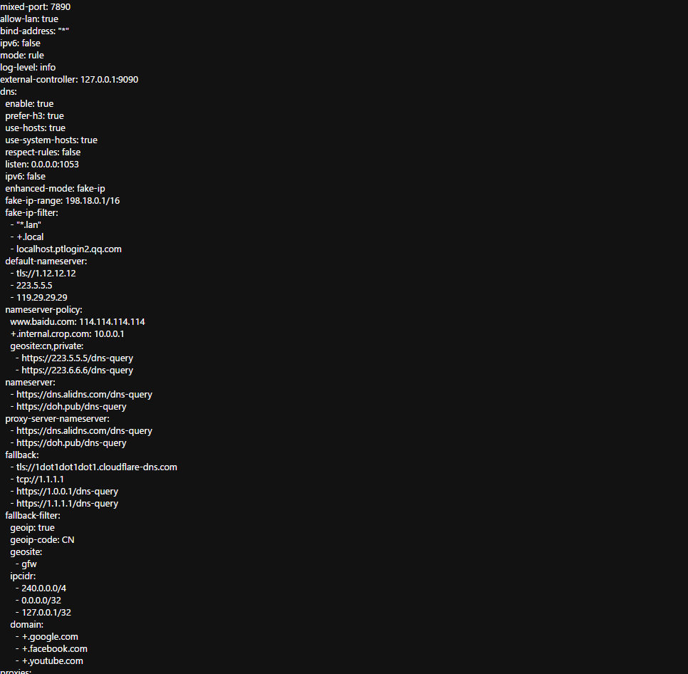
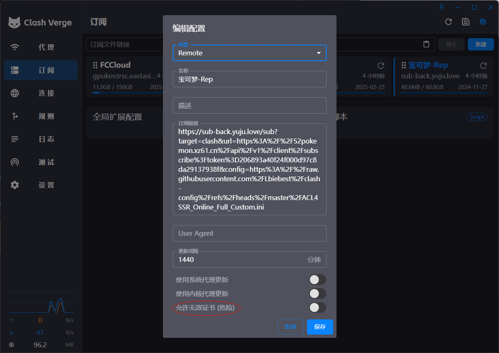

# Clash 配置管理工具

[](https://github.com/Lbiebest/clash-config/stargazers)
[](https://github.com/Lbiebest/clash-config/LICENSE)

## 简介

这个仓库提供了一套完整的 Clash 配置管理解决方案，包括基础配置文件、规则集、自定义规则和订阅转换指南。旨在帮助用户快速构建和优化自己的 Clash 配置，实现高效稳定的网络体验。

## 功能特点

- ✅ 预设优化的 DNS 配置
- ✅ 分类清晰的策略组设置
- ✅ 全面的分流规则集
- ✅ 支持远程配置和订阅转换
- ✅ 详细的配置文档和使用指南

## 目录结构

```
clash-config/
├── local-config/           # 本地配置目录
├── docs/                   # 文档目录
│   ├── 配置文件.md         # Clash 配置文件详解
│   ├── DNS.md              # DNS 配置指南
│   ├── 策略组.md           # 策略组配置说明
│   ├── 分流规则.md         # 分流规则说明
│   ├── 远程配置文件.md      # 远程配置使用指南
│   └── image/              # 文档图片资源
├── rules/                  # 规则文件目录
│   └── CustomDirect.list   # 自定义直连规则
├── default-config.yml      # 默认配置模板
├── ACL4SSR_Online_Full.ini             # ACL4SSR 在线完整配置
└── ACL4SSR_Online_Full_Custom.ini      # 自定义 ACL4SSR 在线配置
```

## 使用指南

### 基础配置

基础配置文件包含了 Clash 的核心设置，包括端口、模式和 DNS 等参数。你可以直接使用 `default-config.yml` 作为基础模板：

<details>
<summary>基础配置示例（点击展开）</summary>

```yml
mixed-port: 7890
allow-lan: true
bind-address: "*"
ipv6: false
mode: rule
log-level: info
external-controller: 127.0.0.1:9090
dns:
  enable: true
  prefer-h3: true
  use-hosts: true
  # 更多 DNS 配置...
```
</details>

### 订阅转换

将现有的订阅链接转换为 Clash 配置的步骤：

1. 准备好你的节点订阅链接
2. 使用订阅转换工具（如 [subconverter](https://github.com/tindy2013/subconverter)）
3. 选择本仓库提供的配置模板（ACL4SSR_Online_Full_Custom.ini）
4. 生成 Clash 配置并导入到 Clash 客户端



### 配置检查

生成配置后，检查转换结果是否符合预期：



如果导入遇到问题，可能需要检查 SSL 证书设置：



## 详细文档

本项目提供了详细的配置文档，涵盖各个方面：

- [配置文件基础](./docs/配置文件.md) - Clash 配置文件的基本结构和参数说明
- [DNS 设置详解](./docs/DNS.md) - DNS 配置的详细说明和优化建议
- [策略组配置](./docs/策略组.md) - 策略组的分类、配置和使用方法
- [分流规则详解](./docs/分流规则.md) - 常用分流规则说明和自定义方法
- [远程配置使用](./docs/远程配置文件.md) - 远程配置的使用和维护指南

## 自定义配置

你可以根据个人需求修改以下文件：

1. `rules/CustomDirect.list` - 添加自定义的直连域名或 IP
2. `ACL4SSR_Online_Full_Custom.ini` - 自定义规则集和策略组

## 贡献指南

欢迎提交 Issues 和 Pull Requests 来完善这个项目。在提交贡献前，请确保你的修改符合项目的目标和规范。

## 许可协议

本项目采用 MIT 许可协议 - 详细信息请查看 [LICENSE](LICENSE) 文件。

## 参考资源

- [Clash 官方文档](https://github.com/Dreamacro/clash/wiki)
- [ACL4SSR 规则](https://github.com/ACL4SSR/ACL4SSR)
- [Subconverter 项目](https://github.com/tindy2013/subconverter)

---

项目参考自: https://linux.do/t/topic/163682
